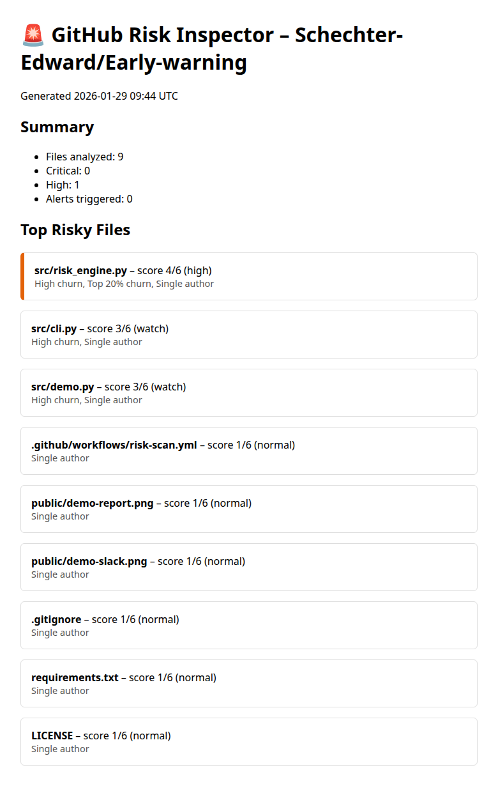
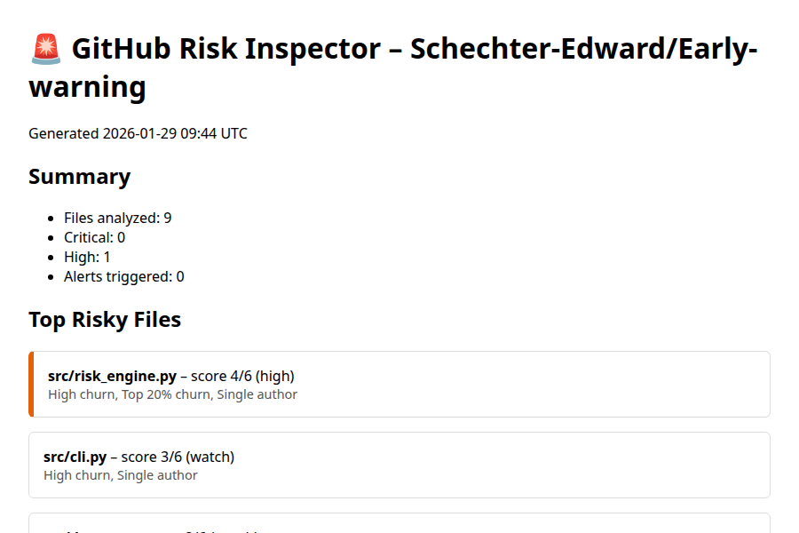

# GitHub Risk Inspector 🚨  
> Early-warning system that spots unstable code **before** it breaks prod.



## 30-Second Pitch
1. Drop the repo URL  
2. Get a one-page report of **which files** are churning too fast  
3. Slack / GitHub issue auto-opened **only** when risk persists ≥ 2 days  

Perfect for teams that want **signal > noise**.

## Quick Run (no install)
```bash
export GITHUB_TOKEN="ghp_xxx"  # optional → higher rate-limit
python src/cli.py owner/repo

Output → risk_report.html opens automatically.
```

## What It Flags
| Signal | Example | Why It Matters |
|--------|---------|----------------|
| High churn | auth.js edited 14× more than repo avg | Logic is unstable |
| 24 h spikes | 3 commits in 1 day | Fix-on-fix pattern |
| Core files | src/auth/* | High blast radius |

## Live Alert Example


## CI / CD in 1 Click
Add the included GitHub Action → risk scan on every push.
No extra infra; runs in < 30 s.

## Tech
Python 3.9+, SQLite, GitHub API (or local git fallback).
Zero external services required.

## Roadmap (PRs welcome)
- [ ] CODEOWNERS auto-assign
- [ ] Grafana dashboard export
- [ ] SonarQube plugin

## License
MIT – use at work, use for fun, just don't blame me 🔥
